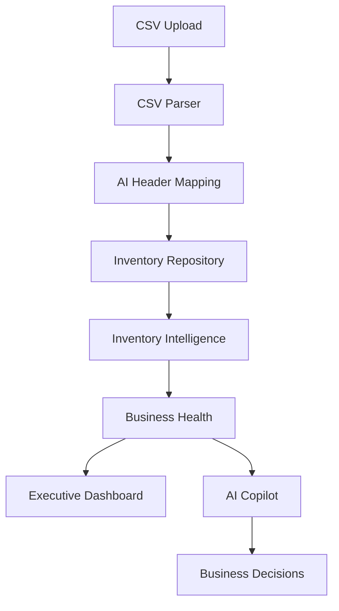

```
NOVA
AI COO for Retail Operations

Transform inventory data into executive decisions in seconds.

Upload inventory → Analyze risks → Prioritize actions → Ask AI → Take action
```

---

```md
<p align="center">
  
  
  
  
  
</p>
```

---

# Why NOVA?

```
Inventory isn't the problem.

Decision making is.

Businesses don't need another dashboard.

They need an AI Chief Operating Officer.

NOVA continuously analyzes inventory, identifies operational risks,
calculates financial impact, prioritizes actions,
and explains every recommendation using transparent evidence.
```

---

# Executive Capabilities

```
✔ Executive Dashboard

✔ AI Chief Operating Officer

✔ Revenue Risk Analysis

✔ Stockout Prediction

✔ Dead Stock Detection

✔ Overstock Detection

✔ Inventory Intelligence

✔ Dynamic CSV Upload

✔ AI Header Mapping

✔ Evidence-Based Recommendations

✔ Natural Language Business Assistant
```

---

## Then

A beautiful workflow

```
CSV Upload

↓

Universal Parser

↓

AI Header Mapping

↓

Inventory Repository

↓

Inventory Intelligence Engine

↓

Business Health Engine

↓

Executive Dashboard

↓

AI Copilot
```

---

## Then

A Mermaid diagram



GitHub renders this beautifully.

---

## Then

Instead of

> Technical Architecture

I'd make

```
Frontend

React
TypeScript
Tailwind
Recharts

↓

REST API

↓

Node.js
Express

↓

AI Layer

Gemini
Reasoning Engine
Evidence Engine

↓

Business Engines

Inventory
Financial
Business Health

↓

Repository

Inventory Snapshot
```

---

## Then

A reviewer section

```
Reviewer Navigation

Dashboard

Products

Upload

AI Copilot

Inventory Engine

Decision Engine

Business Health

Financial Engine

AI Context

Evidence Engine
```

Very useful for judges and recruiters.

---

## Then

A roadmap like:

```
Current

[x] Dashboard

[x] AI Copilot

[x] Inventory Intelligence

[x] Dynamic Upload

[x] Products

[x] Business Health

Coming Soon

[ ] Historical Snapshots

[ ] Forecasting

[ ] Multi-store

[ ] Executive Reports

[ ] Daily AI Briefing

[ ] SaaS Platform
```

---

```
Built with ❤️ by Team NOVA

AI should help businesses make better decisions,
not just generate more dashboards.

NOVA is building the operating system for modern retail.
```

---

