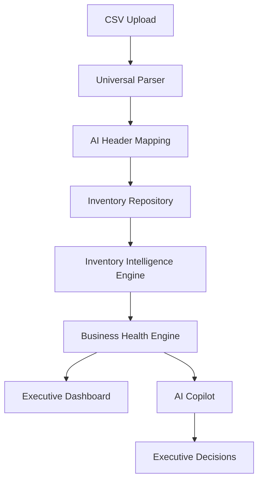

# NOVA — System Architecture

This document is the complete technical map of NOVA: every layer, every folder, every business engine, and the reasoning behind how they're separated. If you're evaluating the codebase, reviewing it for a role, or contributing to it, start here.

## Contents

- [Overall System Architecture](#overall-system-architecture)
- [Backend Architecture](#backend-architecture)
- [Inventory Intelligence Pipeline](#inventory-intelligence-pipeline)
- [Dashboard Data Flow](#dashboard-data-flow)
- [Request Lifecycle](#request-lifecycle)
- [Folder-by-Folder Breakdown](#folder-by-folder-breakdown)
- [Business Engines](#business-engines)
- [Design Principles](#design-principles)
- [Performance & Scalability](#performance--scalability)

---

## Overall System Architecture



Everything in NOVA flows toward one goal: turning a raw CSV into a decision an executive can act on. Data enters through the parser, gets normalized and mapped by AI, becomes the single source of truth in the repository, and is then interpreted by two consumer surfaces — the dashboard (structured, visual) and the copilot (conversational, on-demand).

---

## Backend Architecture

```text
Controllers
   ↓
Services
   ↓
Builders
   ↓
Business Engines
   ↓
Repository
   ↓
AI Layer
   ↓
Gemini
```

Every layer has exactly one job:

| Layer | Responsibility |
|---|---|
| **Controllers** | Receive HTTP requests, validate shape, delegate immediately — no business logic lives here |
| **Services** | Orchestrate a use case: call the right builders and engines in the right order |
| **Builders** | Transform raw/normalized data into the business objects the rest of the system understands |
| **Business Engines** | Own the actual business logic — financial math, health scoring, decisioning |
| **Repository** | The single source of truth for inventory state |
| **AI Layer** | Reasons over what the engines already calculated — it never calculates on its own |

This is a strict pipeline. A controller never talks to an engine directly, and an engine never talks to Gemini directly. That separation is what makes NOVA's output explainable — you can always point to the exact layer that produced a number.

---

## Inventory Intelligence Pipeline

```text
CSV
 ↓
Parse
 ↓
Normalize
 ↓
Header Mapping
 ↓
Inventory Builder
 ↓
Repository
 ↓
Health Engine
 ↓
Financial Engine
 ↓
Decision Engine
 ↓
Dashboard
```

This is the path every uploaded file takes before it ever reaches a user. The important detail: **header mapping happens after parsing, not before.** NOVA doesn't require your CSV to match a fixed schema — it parses whatever structure you give it, then uses AI to map your headers (`"Qty"`, `"Stock Qty"`, `"On Hand"`, etc.) onto NOVA's internal schema.

---

## Dashboard Data Flow

```text
Inventory Repository
 ↓
Dashboard Service
 ↓
Executive Brief
 ↓
Business Health
 ↓
Metrics
 ↓
Charts
 ↓
React Dashboard
```

The dashboard never queries the repository directly — it goes through the Dashboard Service, which assembles an "Executive Brief" (the day's most important state) before anything is rendered. This keeps the frontend dumb by design: it displays what it's given rather than deciding what matters.

---

## Request Lifecycle

```text
Frontend
 ↓
Express Route
 ↓
Controller
 ↓
Service
 ↓
Builders
 ↓
Engines
 ↓
Repository
 ↓
Response
```

Every single request — dashboard load, CSV upload, or copilot question — takes this same shape. That consistency is intentional: once you understand this lifecycle, you understand how to trace *any* bug or *any* feature request through the codebase.

---

## Folder-by-Folder Breakdown

```text
src/
├── controllers/
│   Receives HTTP requests and validates incoming data.
│
├── services/
│   Coordinates multiple business modules and prepares API responses.
│
├── builders/
│   Transforms raw inventory into the business objects used throughout NOVA.
│
├── engines/
│   Core business logic:
│     - Financial calculations
│     - Inventory health
│     - Decision making
│     - Business health scoring
│
├── ai/
│   - Context assembly
│   - Evidence construction
│   - Prompt engineering
│   - Reasoning
│   - Response parsing
│
├── brain/
│   - Intent understanding
│   - Context selection
│   - Decision orchestration
│
└── repositories/
    Single source of truth for inventory data.
```

Read top to bottom, this folder structure *is* the request lifecycle. A new contributor can open `src/` and understand where any given piece of logic belongs without reading a single line of implementation.

---

## Business Engines

Each engine is single-purpose and independently testable. None of them call Gemini — they produce the numbers the AI layer later reasons over.

### Inventory Health Engine
**Purpose:** Determines stock health using:
- Inventory on hand
- Average daily sales
- Lead time
- Reorder level

**Output:** Health score, stockout days, recommendation.

### Financial Engine
**Purpose:** Converts inventory risk into dollar terms — revenue at risk from stockouts, capital tied up in dead stock, and carrying cost of overstock.

**Output:** Revenue-at-risk figures, capital-exposure figures, cost breakdowns.

### Business Health Engine
**Purpose:** Aggregates output from every other engine into a single operational health view for the business as a whole, not just per-SKU.

**Output:** Overall health score, top risk categories, trend direction.

### Decision Engine
**Purpose:** Takes the output of the other engines and ranks it — deciding what deserves executive attention *today* versus what can wait.

**Output:** A prioritized action list, each item traceable to the engine and data that produced it.

### Dead Stock Engine
**Purpose:** Identifies SKUs with little or no movement over a defined window, signaling capital that's stuck rather than working.

**Output:** Dead stock list, days since last sale, capital tied up.

### Overstock Engine
**Purpose:** Flags inventory levels that exceed a healthy threshold relative to sales velocity, ahead of it becoming a write-off.

**Output:** Overstock list, excess units, holding cost estimate.

---

## Design Principles

- **Single Source of Truth (Repository Pattern)** — every engine, service, and AI call reads from the same inventory repository. No duplicated or drifting state.
- **Modular Business Engines** — each engine solves one problem and can be tested, replaced, or extended without touching the others.
- **Explainable AI** — every recommendation the copilot gives is backed by evidence assembled from real engine output, not model speculation.
- **Deterministic Business Logic** — financial and health calculations are plain code. They will produce the same output every time, which matters when the output drives real business decisions.
- **AI Never Calculates Business Numbers** — Gemini's job is to reason over and explain numbers the engines already computed. It never becomes the source of a number itself.
- **Separation of Business Logic and AI Reasoning** — engines and the AI layer are architecturally separate so either can evolve independently (e.g., swapping the AI provider doesn't touch business logic at all).
- **Scalable, Service-Oriented Architecture** — the service layer exists specifically so new capabilities (multi-store, forecasting) can be added as new services without restructuring existing ones.

---

## Performance & Scalability

**Why the Repository Pattern?**
Centralizing inventory state in one repository means every engine and every AI call sees a consistent view of the data. It also means scaling storage (e.g., moving to a different database, adding caching) touches one layer instead of every consumer.

**Why separate AI from calculations?**
Business math has to be reliable and auditable — the same inputs must always produce the same outputs. Keeping calculations in deterministic code (not the model) means NOVA's numbers can be trusted and debugged like any other software, while still getting the benefit of AI for the harder problem: turning numbers into a clear explanation.

**How NOVA scales to thousands of products:**
Because engines operate on the repository rather than on raw CSVs directly, the ingestion path (parse → normalize → map → store) is decoupled from the analysis path (engines → dashboard/copilot). This means the analysis layer doesn't care whether the repository holds a hundred SKUs or a hundred thousand — it queries the same interface either way.

**How the AI stays explainable at scale:**
The AI layer never receives the entire inventory as context — it works through the evidence and context builders (see [`AI_PIPELINE.md`](./AI_PIPELINE.md)), which select only the relevant subset of data for a given question. This keeps responses fast, keeps prompts small, and keeps every answer traceable to specific evidence rather than a fuzzy summary of everything.

---

For how the AI layer specifically reasons over this architecture's output, see [`AI_PIPELINE.md`](./AI_PIPELINE.md).
For backend endpoints, see [`API_REFERENCE.md`](./API_REFERENCE.md).
